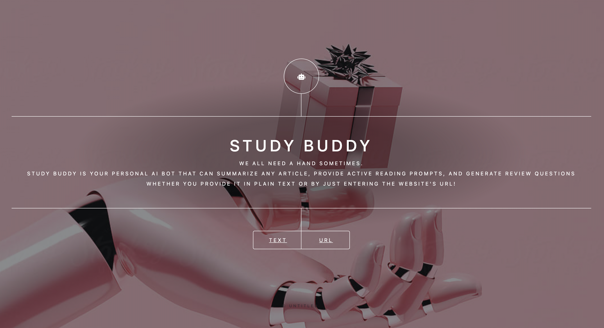
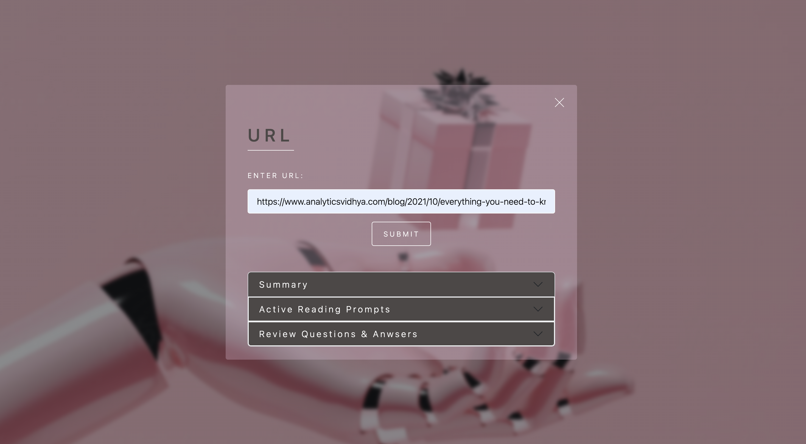
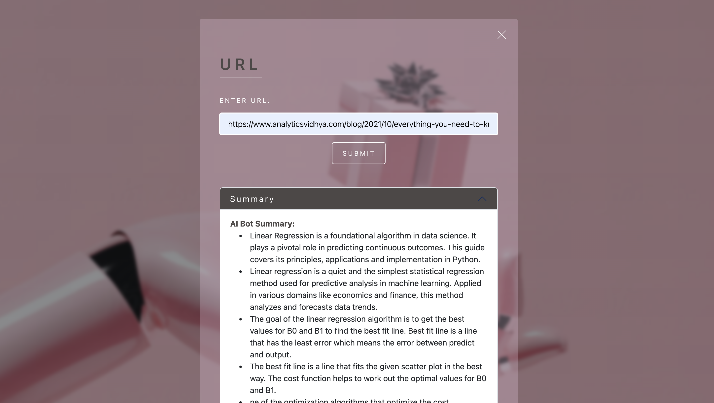
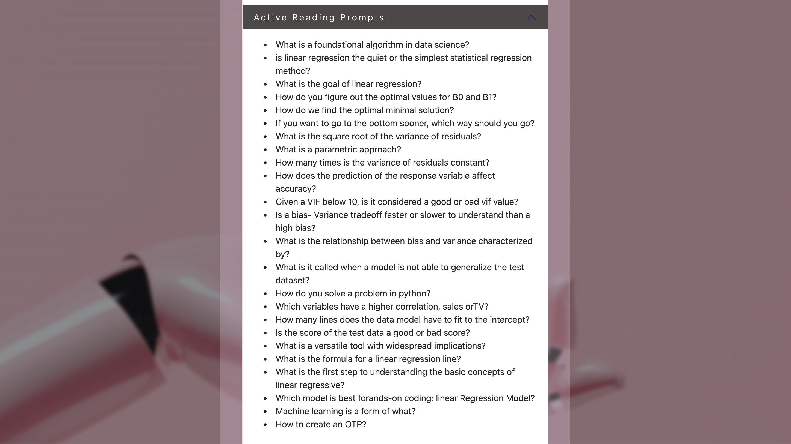

<h1>
      Study Buddy AI Bot
</h1>

Study Buddy is your personal AI bot designed to assist you in summarizing articles, providing active reading prompts, and generating review questions. Whether you input plain text or a URL, Study Buddy leverages state-of-the-art natural language processing models to enhance your study experience.

<h2>Why Study Buddy?</h2>

    
Study Buddy emerged from the frustration of lacking a reliable tool for summarizing articles and generating review questions, particularly when entering URLs into chat platforms like ChatGPT. As someone who values recall for effective studying, existing solutions fell short.

    
Motivated by this frustration, Study Buddy was created as the ultimate study companion. It addresses the need for a tool that not only delivers concise article summaries but also actively engages users with content through reading prompts and facilitates effective review with generated questions and answers.

    
Built on personal experiences, Study Buddy aims to provide a seamless and efficient solution for enhancing the study experience. It's not just a project; it's a practical response to the challenges faced during the study process. By sharing Study Buddy, the goal is to contribute to a more efficient and enjoyable learning journey for students, researchers, and anyone passionate about effective learning.

<h2>Features</h2>

<ul>
  <li><strong>Summarization:</strong> Get concise summaries of articles to quickly grasp key information.</li>
  <li><strong>Active Reading Prompts:</strong> Receive prompts to engage actively with the content while reading.</li>
  <li><strong>Review Questions & Answers:</strong> Generate questions and answers for effective review and understanding.</li>
</ul>

<h2>Getting Started</h2>

<h3>Prerequisites</h3>

<ul>
  <li>Python 3.7 or higher</li>
  <li>FastAPI</li>
  <li>Transformers library</li>
  <li>BeautifulSoup</li>
  <li>Selenium</li>
  <li>Flask</li>
</ul>

<h3>Installation</h3>

<ol>
  <li>Clone the repository:</li>
</ol>

<pre><code>git clone https://github.com/lafonsecallorca/link_ai_study_buddy.git</code></pre>

<ol start="2">
  <li>Install dependencies:</li>
</ol>

<pre><code>pip install -r requirements.txt</code></pre>

<ol start="3">
  <li>Run the FastAPI server:</li>
</ol>

<pre><code>uvicorn main:app --reload</code></pre>

<ol start="4">
  <li>Open the Study Buddy web application:</li>
</ol>

<pre><code>http://127.0.0.1:8000/</code></pre>

<h2>Usage</h2>

<ol>
  <li><strong>Text Input:</strong>
      <ul>
          <li>Enter your text in the designated area and click "Submit."</li>
          <li>Receive a summary, active reading prompts, and review questions.</li>
      </ul>
  </li>
      

  <li><strong>URL Input:</strong>
      <ul>
          <li>Enter a URL in the designated area and click "Submit."</li>
          <li>Receive a summary, active reading prompts, and review questions based on the content of the provided URL.</li>
      </ul>
  </li>
</ol>

<h2>Contributing</h2>

Contributions are welcome! If you have ideas for improvements or encounter issues, feel free to <a href="https://github.com/lafonsecallorca/link_ai_study_buddy/issues">open an issue</a> or submit a pull request.

<h2>License</h2>

This project is licensed under the <a href="LICENSE">MIT License</a>.

<h2>Acknowledgments</h2>

Special thanks to the developers of the Transformers library for their invaluable contributions to the project.

